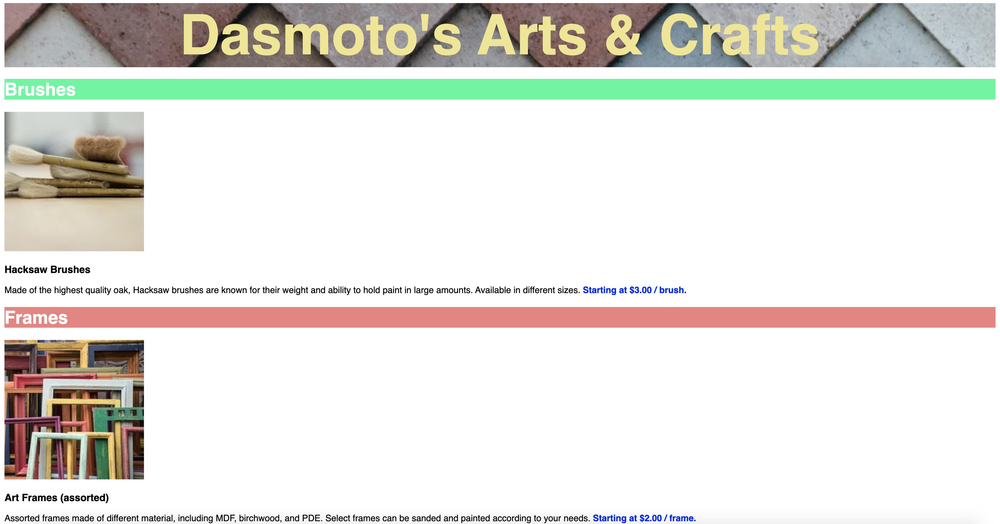
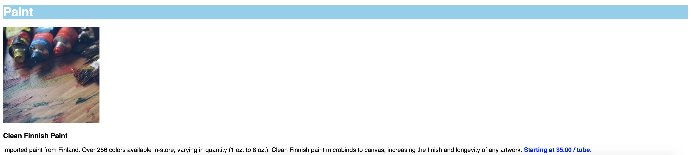

# Dasmoto's Arts and Crafts

## Description 
This project is a portfolio project from Codecademy's Full Stack Engineer path. The purpose of this project is to create a static website with HTML and CSS based on a client's wireframe. 

## Table of Contents
* [Installation](#installation)
* [Usage](#usage)
* [License](#license)
* [Contributing](#contributing)
* [Tests](#tests)
* [Questions](#questions)

## Installation 
No installation required, but user can clone repository. 

## Usage 
This application is based on the wireframe below:

The site I created: 

## License 
This project is license under MIT

## Contributing 
This is a project from Codecademy's Full Stack Engineer career path. 

## Tests
There are no tests for this application. 

## Questions
If you have any questions about this projects, please contact me directly at nicole.elisaw@gmail.com. You can view more of my projects at https://github.com/nicolewallace09.
